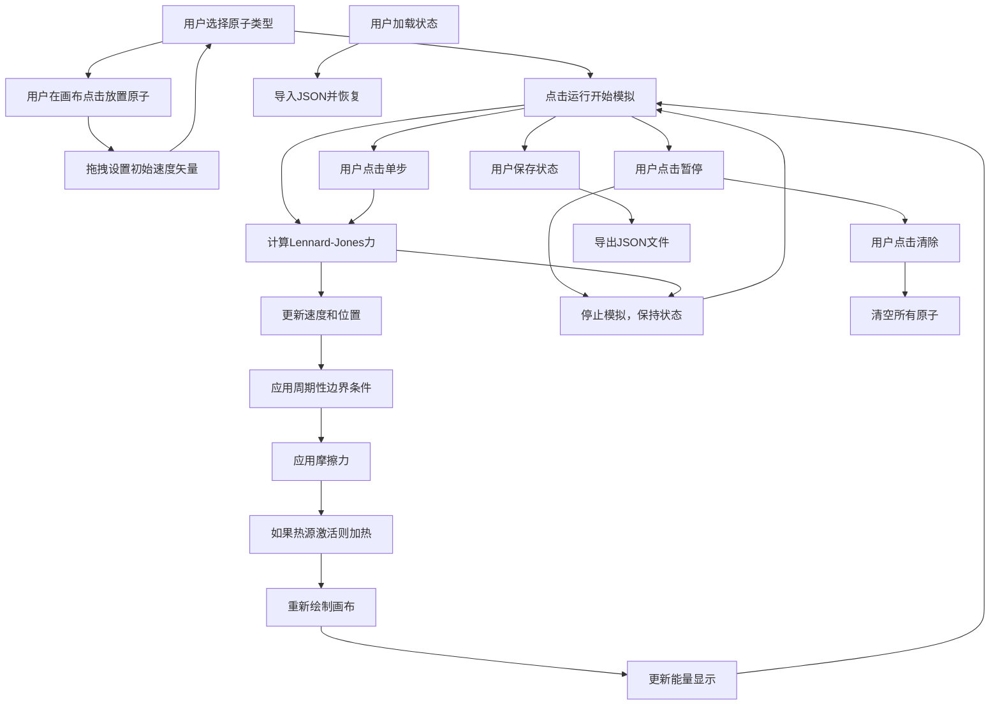

## 1. 产品概述

一个基于HTML5 Canvas的交互式二维分子动力学模拟器，用于可视化展示原子间相互作用和经典力学运动规律。支持用户交互式添加原子、设置物理参数，并实时观察系统演化过程。

- 核心价值：提供直观的物理模拟体验，帮助理解分子间作用力、能量守恒和统计力学基本概念
- 目标用户：物理学学生、教师和对计算物理感兴趣的爱好者

## 2. 核心特性

### 2.1 用户角色

本应用无角色区分，所有用户拥有相同功能权限。

### 2.2 功能模块

1. **主页面**：Canvas模拟画布、控制面板、能量信息显示
2. **交互模块**：原子放置、初始速度拖拽设置、热源添加
3. **物理引擎**：Lennard-Jones势能计算、牛顿运动方程积分、周期性边界条件
4. **控制系统**：播放/暂停、单步执行、重置清除、温度/摩擦力调节
5. **数据持久化**：保存/加载模拟状态（JSON格式）

### 2.3 页面详情

| 页面名称 | 模块名称 | 功能描述 |
|-----------|-------------|---------------------|
| 主页面 | Canvas画布 | 二维模拟区域，绘制原子和相互作用，支持周期性边界条件 |
| 主页面 | 原子类型选择 | 提供不同质量、大小、颜色的原子类型供用户选择 |
| 主页面 | 交互控制 | 通过拖拽设置初始速度矢量，点击放置原子 |
| 主页面 | 模拟控制 | 运行/暂停、单步执行、清除所有、重置模拟 |
| 主页面 | 参数调节 | 温度调节（整体速度缩放）、摩擦力调节（能量耗散） |
| 主页面 | 能量显示 | 实时显示动能、势能、总能量 |
| 主页面 | 热源设置 | 支持添加固定区域热源，持续向系统注入能量 |
| 主页面 | 状态保存/加载 | 导出当前状态为JSON文件，从文件加载回放 |

## 3. 核心流程

## 4. 用户界面设计

### 4.1 设计风格

- **色彩方案**：深蓝色背景模拟宇宙空间感，使用明亮饱和的不同颜色区分原子类型，对比度清晰
- **布局**：左侧画布，右侧控制面板，采用卡片式设计，留白充足
- **字体**：使用现代无衬线字体Inter，标题加粗，参数标签清晰可读
- **控件**：圆角滑块、按钮，带有悬停和点击反馈，简约现代风格
- **整体风格**：科学仪器感，干净、专业、现代

### 4.2 页面设计概览

| 页面名称 | 模块名称 | UI元素 |
|-----------|-------------|-------------|
| 主页面 | Canvas画布 | 深灰蓝色背景，圆形原子带有发光效果，拖拽时显示速度矢量线 |
| 主页面 | 原子类型选择 | 彩色小圆形预览按钮，选中状态高亮边框 |
| 主页面 | 模拟控制 | 大按钮分组，播放/暂停使用明显图标区分 |
| 主页面 | 参数调节 | 带标签的滑块控件，实时显示当前值 |
| 主页面 | 能量显示 | 三行文本框，数字实时更新，使用不同颜色区分能量类型 |
| 主页面 | 保存/加载 | 文件输入和下载按钮，简洁设计 |

### 4.3 响应性

- 桌面优先设计，画布大小自适应容器
- 控制面板固定宽度，布局清晰不拥挤
- 支持不同屏幕尺寸，保证交互控件尺寸适合鼠标操作

### 4.4 交互设计

- 放置原子：点击画布即可放置当前选择类型的原子
- 设置速度：按下拖拽绘制矢量箭头，松开确认速度方向和大小
- 调节参数：滑块拖动实时生效
- 视觉反馈：原子碰撞时轻微加深颜色，能量数值平滑更新
