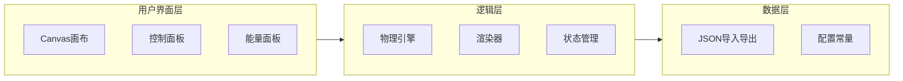

## 1. 架构设计

采用单页面纯前端架构，使用HTML5 Canvas + 原生CSS + 原生JavaScript（ES6+），无外部框架依赖。



## 2. 技术描述

- 前端：HTML5 + CSS3 + 原生JavaScript（ES2020），单文件整合所有功能
- 渲染：HTML5 Canvas 2D Context，requestAnimationFrame动画循环
- 物理引擎：自实现Velocity Verlet积分器 + Lennard-Jones势能（截断+移位）
- 数据持久化：File API + JSON序列化
- 部署：纯静态HTML文件，浏览器直接打开即可使用

## 3. 文件结构

```
project-root/
├── index.html              # 主页面（HTML结构 + CSS + JS全部内联）
└── .trae/
    └── documents/
        ├── prd.md          # 产品需求文档
        └── tech.md         # 技术架构文档（本文件）
```

## 4. 模块设计

### 4.1 Canvas画布模块

- 使用Canvas 2D渲染原子（圆形填充+径向渐变模拟3D效果）
- 绘制原子间相互作用力线（可选显示）
- 绘制速度矢量箭头
- 绘制热源区域高亮
- 处理鼠标事件（点击放置、拖拽设置速度、调整热源区域）

### 4.2 物理引擎模块

核心常数与模型：

- Lennard-Jones势能：`U(r) = 4ε[(σ/r)^12 - (σ/r)^6]`，采用截断半径rc=2.5σ，在截断处移位以保证连续性
- 力：`F = -dU/dr`，仅计算截断半径内的原子对
- 积分器：Velocity Verlet算法
- 周期性边界条件：位置和最近镜像距离计算
- 温度：通过速度缩放实现，`v' = v * sqrt(T_target / T_current)`
- 摩擦力：`F_friction = -γ * v`，每步速度衰减

### 4.3 控制面板模块

- 播放/暂停按钮切换
- 单步执行按钮
- 清除所有/重置按钮
- 原子类型选择器（3-4种不同质量/颜色）
- 温度滑块（0.1 - 10.0，初始1.0）
- 摩擦力滑块（0 - 0.5，初始0.01）
- 热源开关和位置设置
- 保存/加载按钮

### 4.4 能量显示模块

- 实时计算并显示总动能 `E_k = Σ(0.5 * m * v²)`
- 实时计算并显示总势能 `E_p = ΣU(rij)`
- 实时计算并显示总能量 `E_total = E_k + E_p`
- 使用颜色区分三种能量指标

### 4.5 状态管理

- 使用简单的JavaScript对象管理全局状态
- 原子数组（包含位置、速度、质量、半径、颜色、类型）
- 热源对象（位置、大小、功率）
- 模拟参数对象（温度、摩擦力、时间步长）
- 运行状态标志（running, paused, stopped）

## 5. 数据结构

### 5.1 原子对象

```javascript
{
  x: number,          // x坐标
  y: number,          // y坐标
  vx: number,         // x方向速度
  vy: number,         // y方向速度
  mass: number,       // 质量
  radius: number,     // 渲染半径
  color: string,      // 颜色
  type: string,       // 类型标识
}
```

### 5.2 热源对象

```javascript
{
  x: number,          // 中心x坐标
  y: number,          // 中心y坐标
  radius: number,     // 影响半径
  power: number,      // 加热功率
  enabled: boolean,   // 是否启用
}
```

### 5.3 保存/加载JSON结构

```javascript
{
  version: number,
  atoms: Atom[],
  heatSource: HeatSource,
  parameters: {
    temperature: number,
    friction: number,
    dt: number,
  },
}
```

## 6. 模拟循环流程

```
每个时间步：
1. 应用温度缩放（逐步接近目标温度）
2. 计算所有原子间的Lennard-Jones力（最近镜像+截断）
3. Velocity Verlet更新速度和位置
4. 应用周期性边界条件
5. 应用摩擦力衰减
6. 应用热源加热（如启用）
7. 计算能量统计
8. 重新渲染Canvas
```

## 7. 非功能性需求

- 性能：支持至少200个原子的60fps流畅模拟
- 精度：时间步长可调，支持亚像素位置精度
- 兼容性：支持Chrome、Firefox、Edge等现代浏览器
- 可用性：所有交互即时响应，拖拽流畅无卡顿